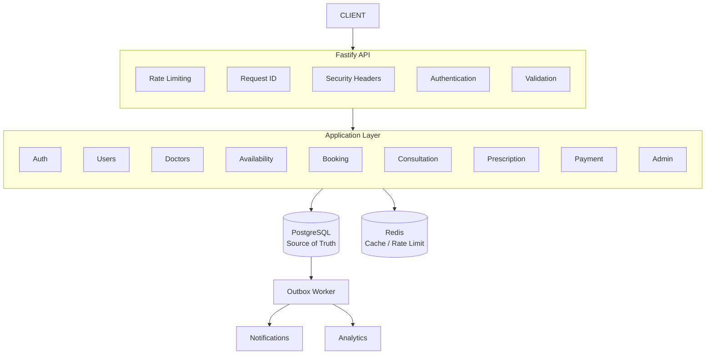
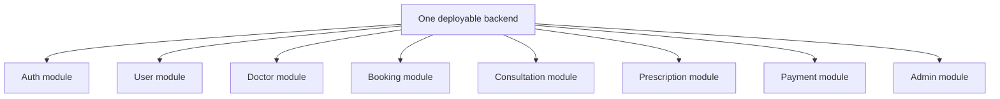

# 1. Technology Stack

## Application

```text
Node.js
TypeScript
Fastify
```

## Database

```text
PostgreSQL
Prisma
```

PostgreSQL is explicitly required by the assignment. Redis is optional. 

## Redis

We will use Redis for:

* Distributed rate limiting
* Short-lived MFA state
* Temporary security counters
* Selective caching

**Redis is never the authoritative source for bookings or payments.**

## Background processing

```text
PostgreSQL Outbox
+
Worker
```

We will **not introduce Kafka** because it isn't required and would add unnecessary infrastructure complexity.

## API

```text
REST
+
OpenAPI
```

The assignment allows either REST or GraphQL. 

## Validation

```text
Zod
```

## Authentication

```text
JWT
+
Refresh Tokens
+
MFA
```

## Password hashing

```text
Argon2id
```

## Testing

```text
Vitest
Supertest
```

## Infrastructure

```text
Docker
Docker Compose
GitHub Actions
```

## Observability

```text
Structured Logging
Prometheus Metrics
```
*(Note: We do not use OpenTelemetry or Distributed Tracing; unique correlation IDs are logged per request to handle tracing.)*

---

# 2. High-Level Architecture



---

# 3. Architectural Principle

We'll use a **modular monolith**.

Not:

```text
20 microservices
```

Instead:



This provides clear domain boundaries while remaining realistic for a 4–5 day implementation.

## Architecture Pragmatism

For critical domains (Booking, Outbox, Concurrency), the application uses a strict separation between Controller and Service layers. However, for simpler CRUD administrative domains (like Admin analytics), controllers may occasionally read from Prisma directly to optimize velocity and avoid over-abstraction.

## Security Checks (Defense in Depth)

While `authorizeRoles(['ADMIN', 'DOCTOR'])` acts as the first role-based access control (RBAC) gate, **Resource Ownership Checks** are explicitly performed within the business logic (e.g., verifying `doctorId` matches the token).

---

# 4. Project Structure

```text
amrutam-backend/

src/
│
├── app/
│   ├── app.ts
│   ├── server.ts
│   ├── config.ts
│   └── container.ts
│
├── modules/
│   │
│   ├── auth/
│   │   ├── auth.controller.ts
│   │   ├── auth.service.ts
│   │   ├── auth.repository.ts
│   │   ├── auth.schema.ts
│   │   ├── auth.types.ts
│   │   └── auth.routes.ts
│   │
│   ├── users/
│   ├── doctors/
│   ├── availability/
│   ├── bookings/
│   ├── consultations/
│   ├── prescriptions/
│   ├── payments/
│   ├── audit/
│   └── admin/
│
├── infrastructure/
│   ├── database/
│   ├── redis/
│   ├── queue/
│   ├── notifications/
│   └── observability/
│
├── middleware/
│   ├── authentication.ts
│   ├── authorization.ts
│   ├── rate-limit.ts
│   ├── request-id.ts
│   └── error-handler.ts
│
├── security/
│   ├── password.ts
│   ├── tokens.ts
│   ├── encryption.ts
│   ├── permissions.ts
│   └── mfa.ts
│
├── shared/
│   ├── errors/
│   ├── types/
│   ├── constants/
│   └── utils/
│
└── jobs/
    ├── notifications.ts
    ├── analytics.ts
    └── cleanup.ts

prisma/
├── schema.prisma
├── migrations/
└── seed.ts

tests/
├── unit/
├── integration/
├── e2e/
└── concurrency/

docs/
├── architecture.md
├── booking-flow.md
├── database.md
├── security.md
├── threat-model.md
└── disaster-recovery.md

infra/
└── docker/

.github/
└── workflows/
    └── ci.yml

Dockerfile
docker-compose.yml
.env.example
README.md
```

---

# 5. Non-Functional Requirements

## Scalability

Must support the specified target of:

**100k daily consultations.**

## Performance

```text
Reads p95 < 200ms
Writes p95 < 500ms
```

## Availability

```text
99.95%
```

## Security

Must implement/document:

```text
Encryption
MFA
RBAC
Rate limiting
Validation
Audit logging
Threat model
OWASP mitigation
Dependency scanning
```

## Reliability

Must support:

```text
Transactions
Idempotency
Concurrency protection
Retries
Backoff
Async processing
Backups
DR strategy
```

## Observability

```text
Logs
Metrics
Traces
```

These requirements are directly specified by the assignment.