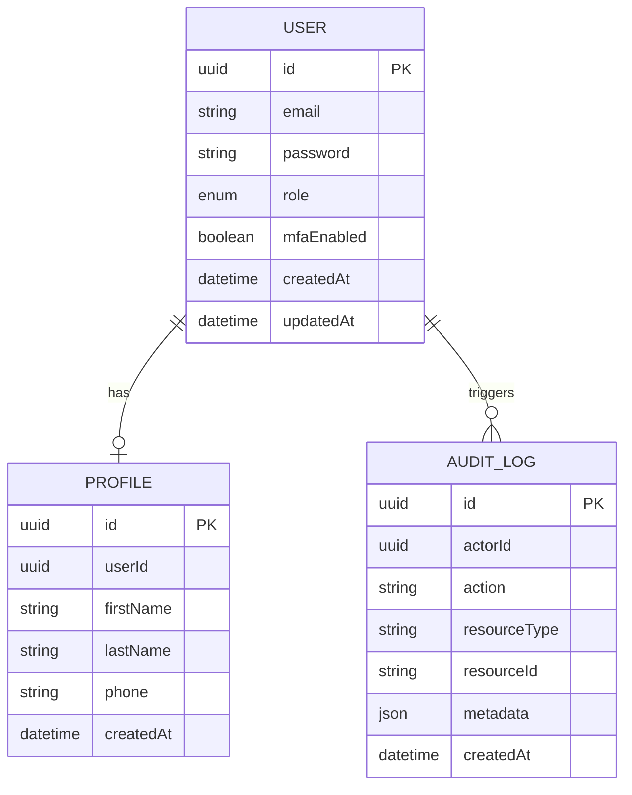
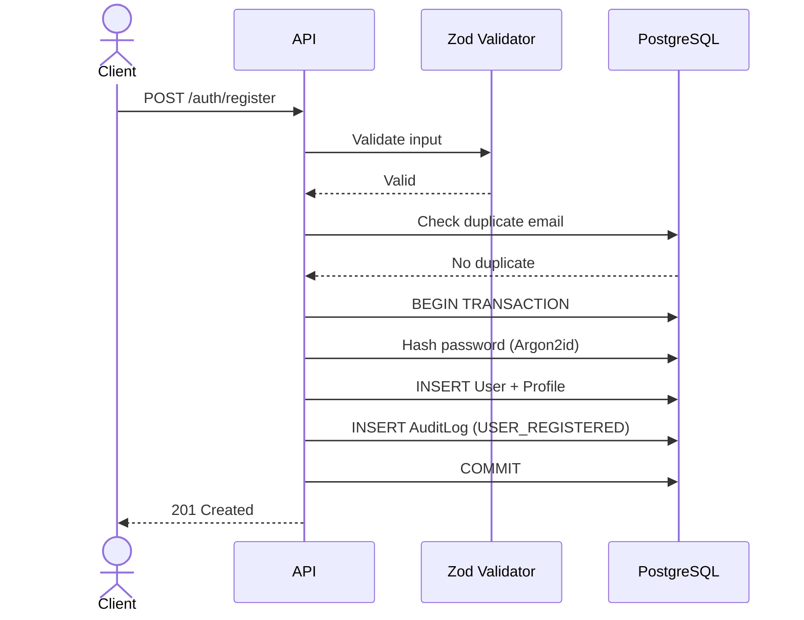
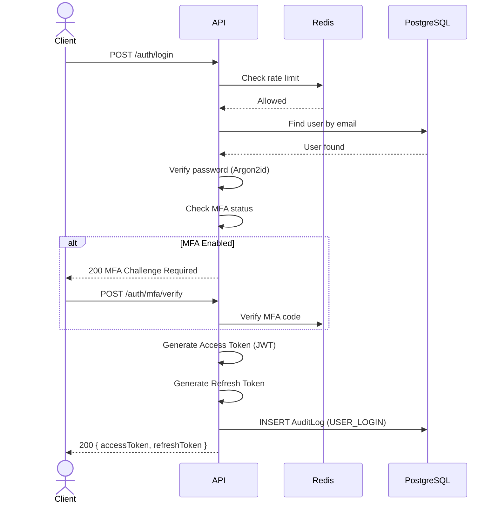
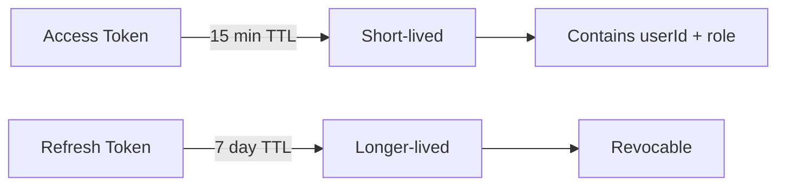
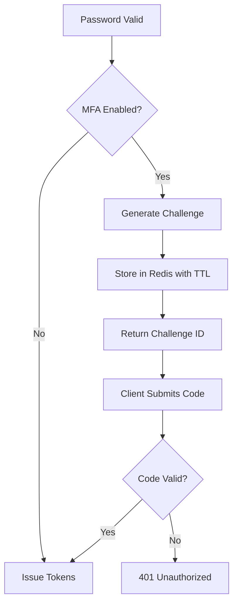
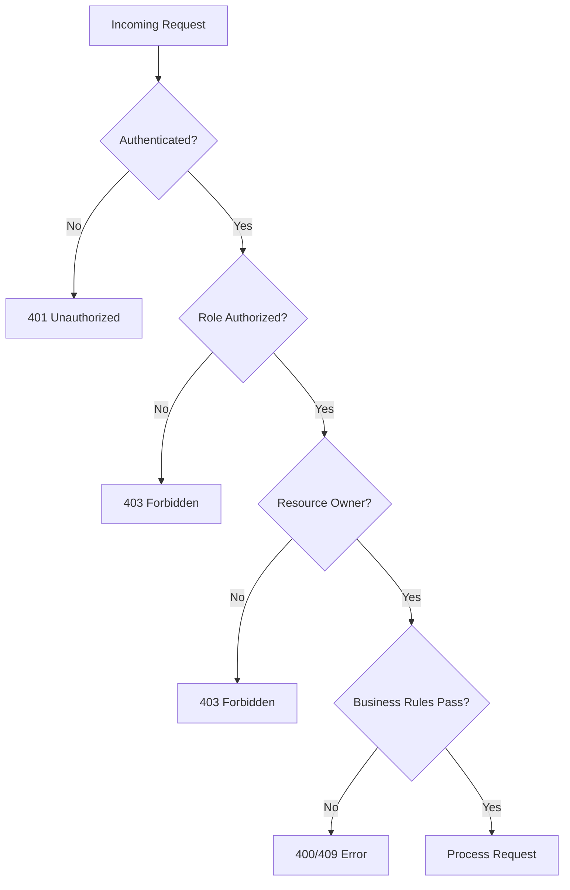

# 1. User Lifecycle

## Entity Relationship Diagram



## Registration

```http
POST /api/v1/auth/register
```



## Login

```http
POST /api/v1/auth/login
```



## Token Model



---

# 2. MFA

MFA is mandatory at the requirement level.



Redis stores short-lived MFA challenge state:

```text
mfa:challenge:<id>
```

with an expiration time. Never store permanent sensitive authentication information in Redis.

---

# 3. Authorization



Example:

```text
PATIENT
  ↓
GET /consultations/:id
  ↓
Is authenticated?
  ↓
Is patient?
  ↓
Does consultation belong to patient?
  ↓
Allow
```

This prevents the common vulnerability:

> "User has permission to read consultations, therefore they can read every consultation."

---