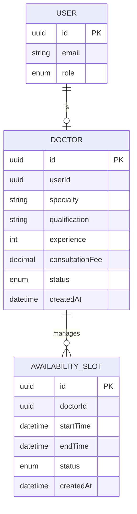
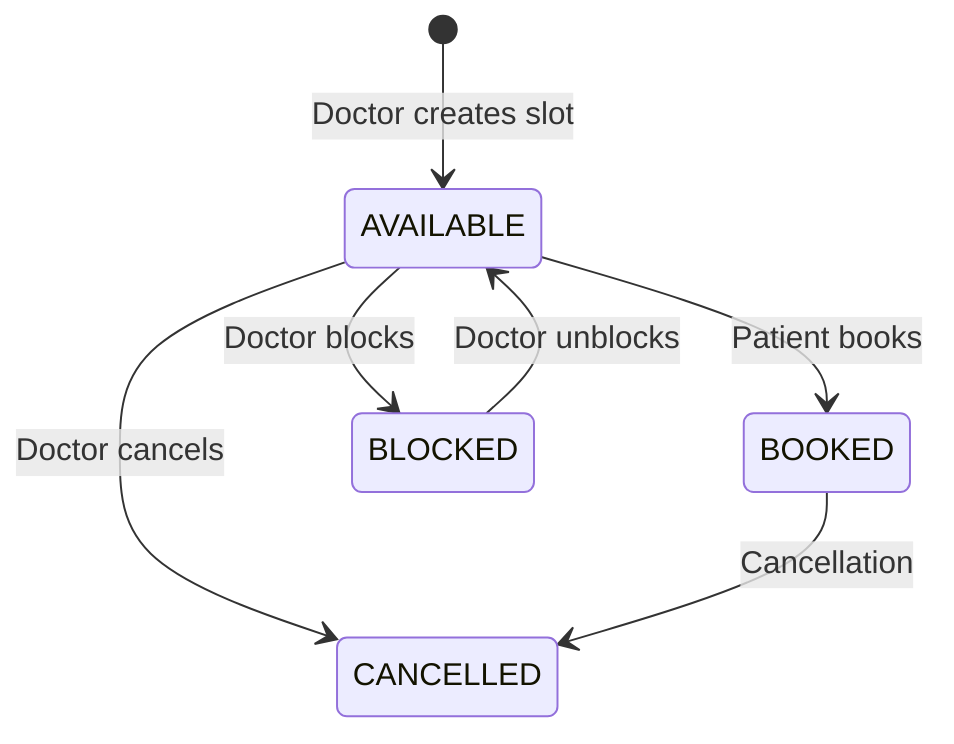
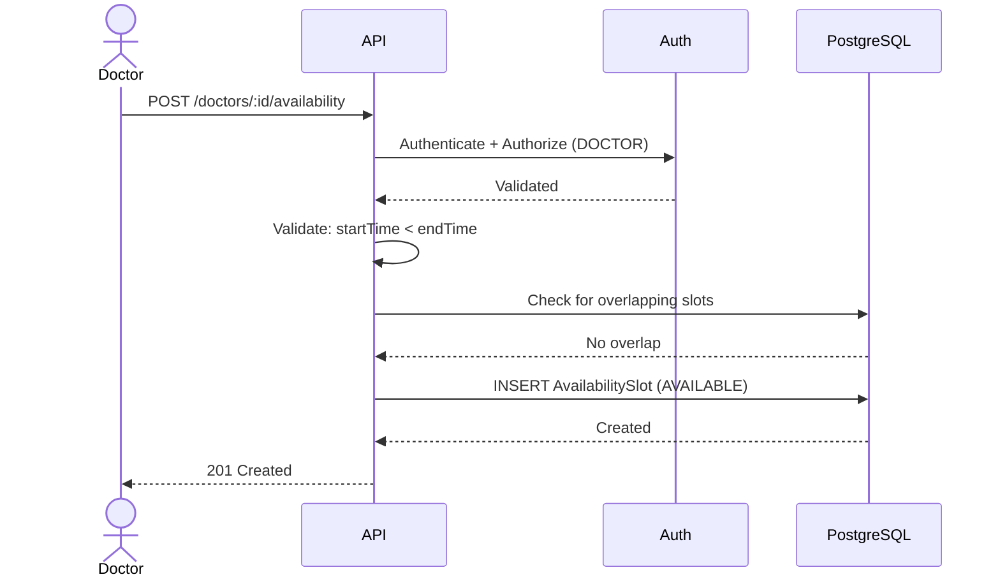
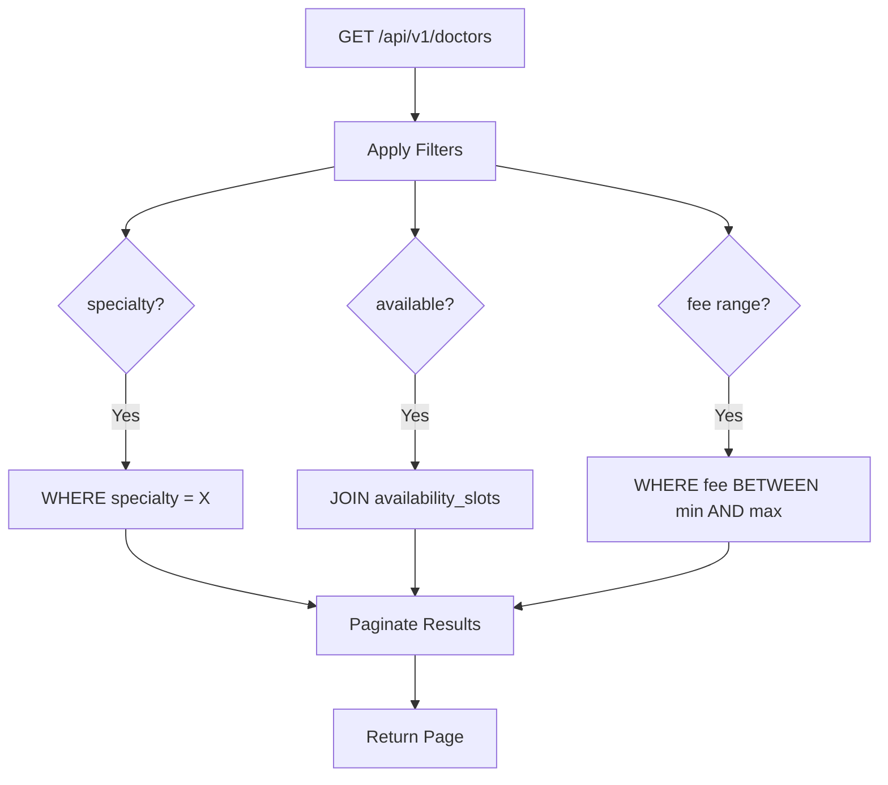

# 1. Doctor Management

## Entity Relationship Diagram



Endpoints:

```text
GET    /api/v1/doctors
GET    /api/v1/doctors/:id
POST   /api/v1/doctors         (ADMIN only)
PATCH  /api/v1/doctors/:id
```

---

# 2. Availability Management

## Slot State Machine



## Create Availability Sequence



Endpoints:

```text
POST   /api/v1/doctors/:id/availability
GET    /api/v1/doctors/:id/availability
DELETE /api/v1/availability/:id
```

---

# 3. Search & Filtering



Example:

```text
GET /doctors?
specialty=cardiology
&available=true
&page=1
&limit=20
```

Performance strategy:

```text
PostgreSQL indexes
+
pagination
+
selective Redis caching
```

---