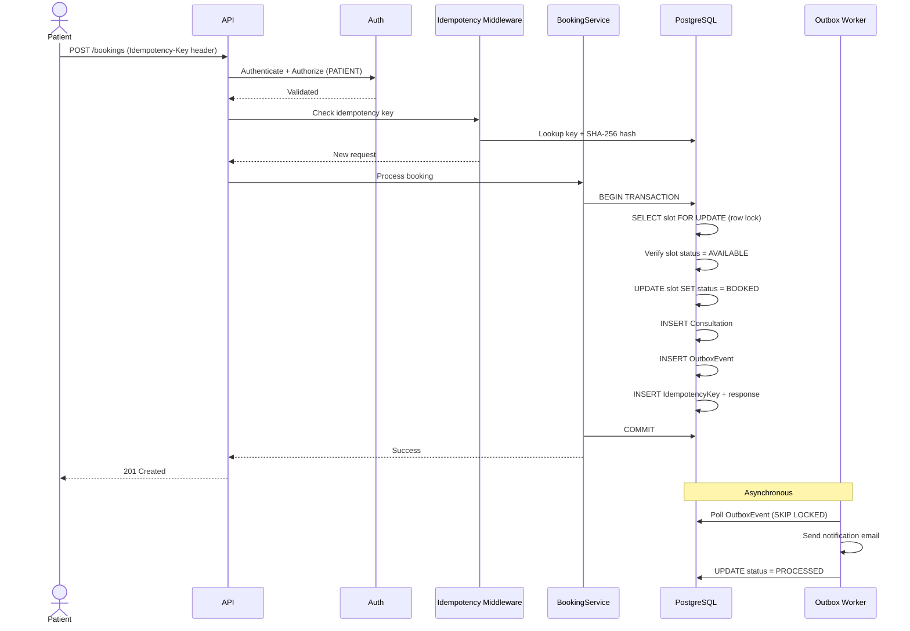
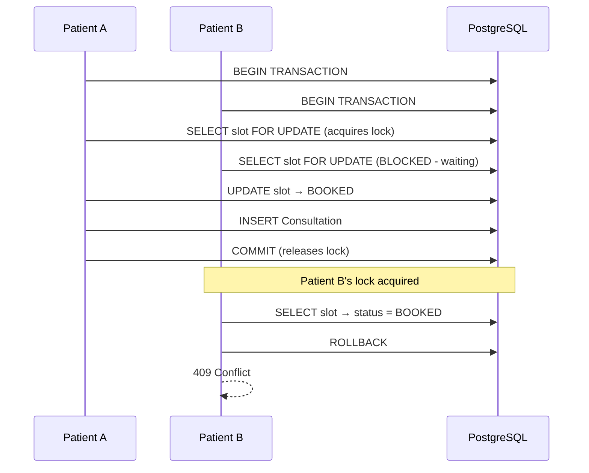
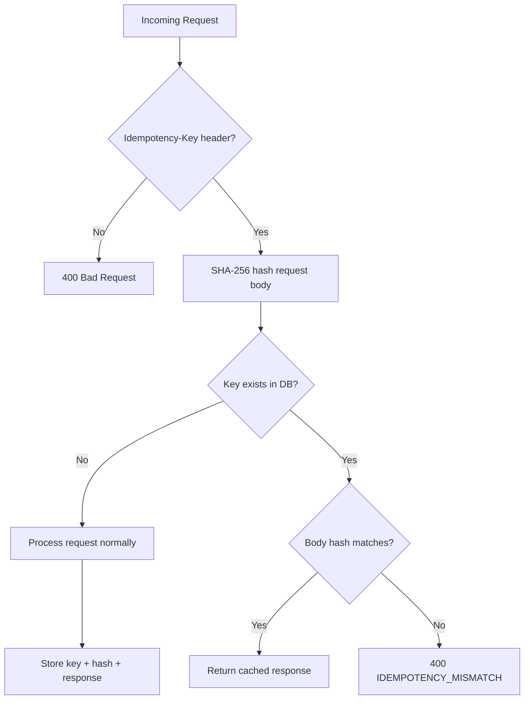
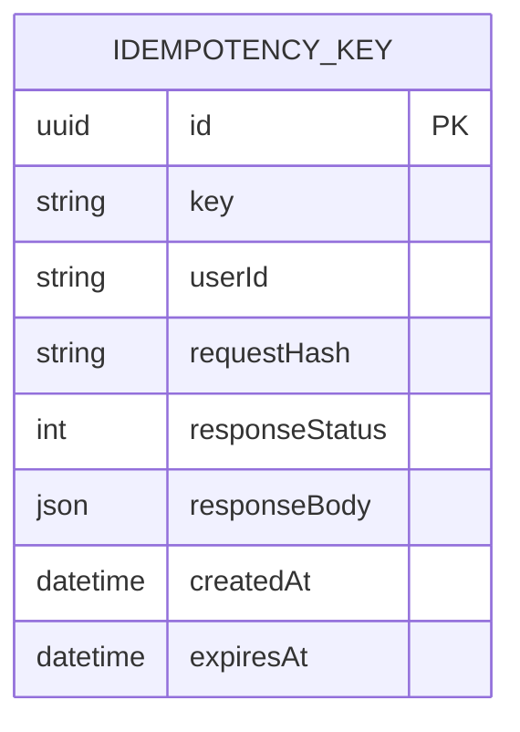

# 1. Booking System

## Booking Sequence Diagram



Endpoint:

```http
POST /api/v1/bookings
```

Required header:

```http
Idempotency-Key: <unique-key>
```

---

# 2. Booking Concurrency

This is a critical correctness requirement.

## Race Condition Prevention



Defense in depth:

```text
PostgreSQL transaction
+
SELECT ... FOR UPDATE (row-level lock)
+
Consultation.slotId @unique (database constraint)
```

---

# 3. Idempotency

## Idempotency Flow





Different payload with same key:

```text
→ 400 IDEMPOTENCY_MISMATCH
```

This protects against retries from clients/load balancers.

---