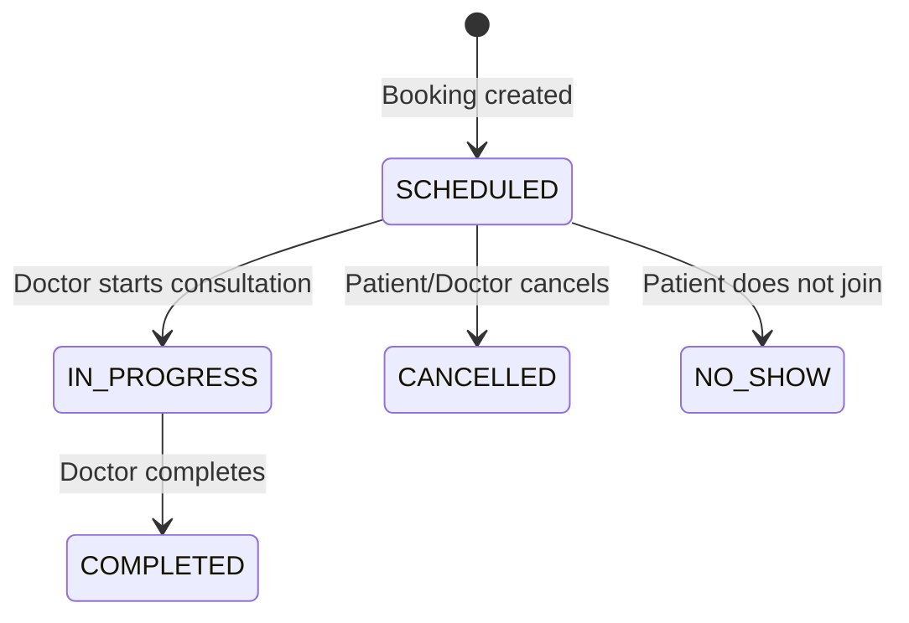
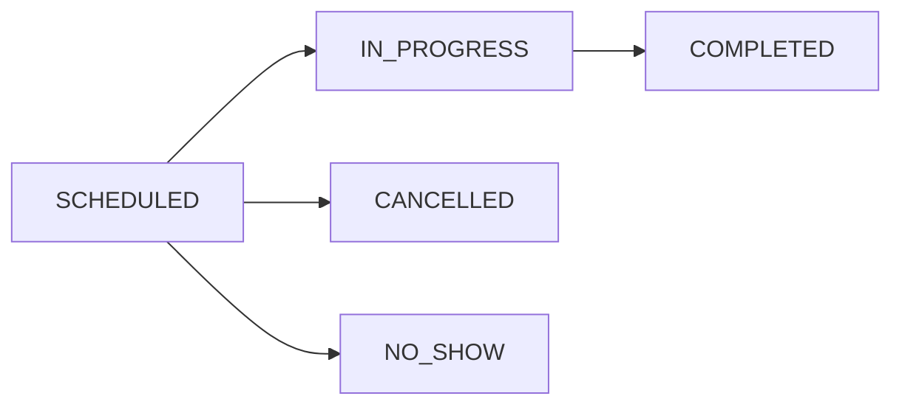
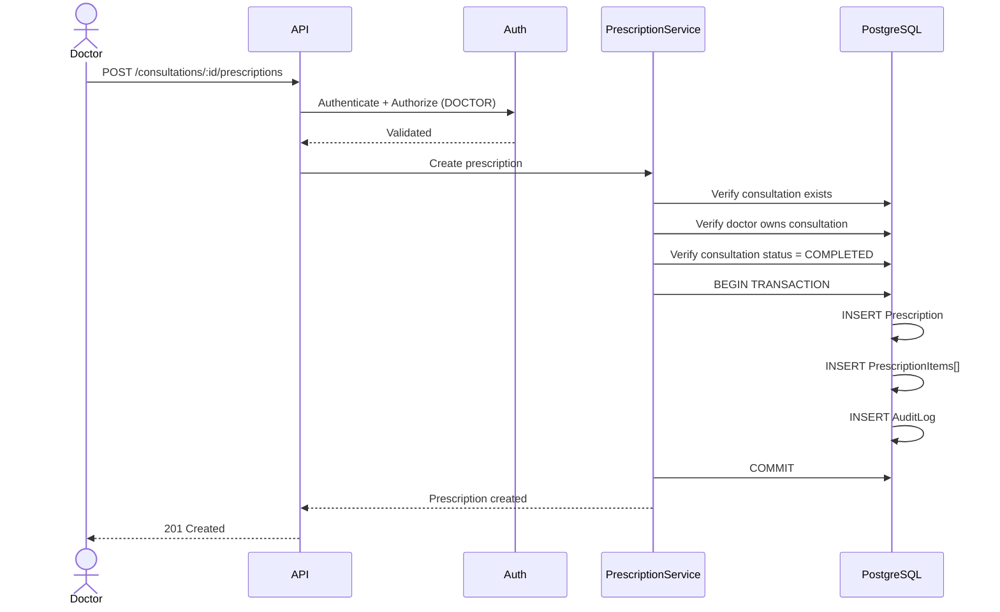

# 1. Consultation Lifecycle

## Entity Relationship Diagram

```mermaid
erDiagram
    AVAILABILITY_SLOT {
        uuid id PK
        uuid doctorId FK
        datetime startTime
        datetime endTime
        enum status
    }
    CONSULTATION {
        uuid id PK
        uuid slotId FK UK
        uuid patientId
        uuid doctorId
        enum status
        string meetingRoomId
        datetime createdAt
    }
    PRESCRIPTION {
        uuid id PK
        uuid consultationId FK UK
        uuid doctorId FK
        string notes
        datetime createdAt
    }
    PRESCRIPTION_ITEM {
        uuid id PK
        uuid prescriptionId FK
        string medicine
        string dosage
        string frequency
        string duration
        string instructions
    }

    AVAILABILITY_SLOT ||--o| CONSULTATION : results_in
    CONSULTATION ||--o| PRESCRIPTION : has
    PRESCRIPTION ||--o{ PRESCRIPTION_ITEM : contains
```

## State Machine



### Valid Transitions



Invalid transitions (rejected by the system):

```text
COMPLETED → SCHEDULED    ❌
CANCELLED → IN_PROGRESS  ❌
NO_SHOW   → SCHEDULED    ❌
```

Endpoints:

```text
GET   /api/v1/consultations
GET   /api/v1/consultations/:id
PATCH /api/v1/consultations/:id/status
```

---

# 2. Prescription System

## Prescription Creation Sequence



Only the assigned doctor can create a prescription. Resource ownership is verified in the business logic.

---