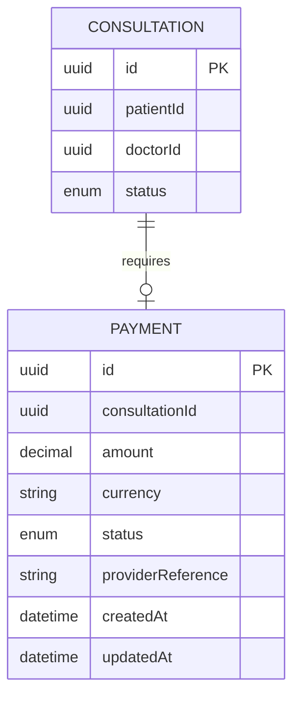
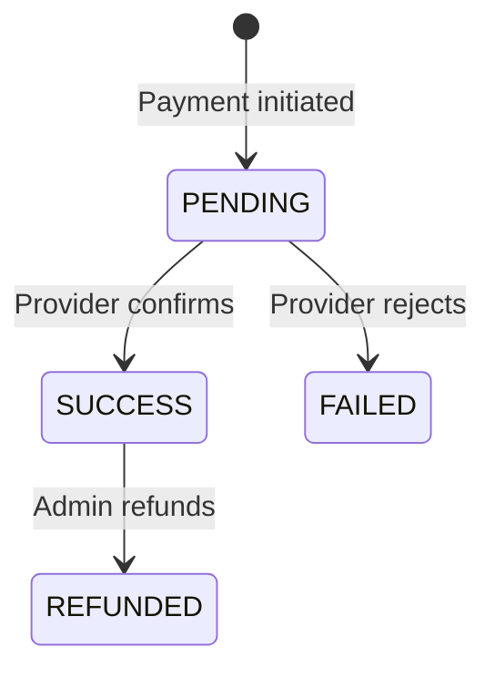
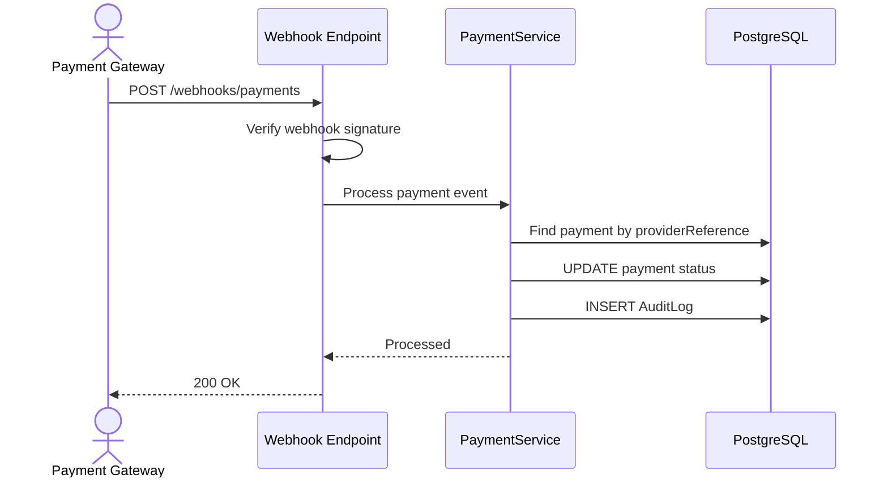

# 1. Payments

The assignment specifies a `payments` table but doesn't define a complete payment-provider workflow.

Therefore we implement the **payment domain**, not build a massive payment integration.

## Entity Relationship Diagram

## Payment State Machine

## Payment Webhook Flow

Payment writes are also idempotent via the `Idempotency-Key` header.

---