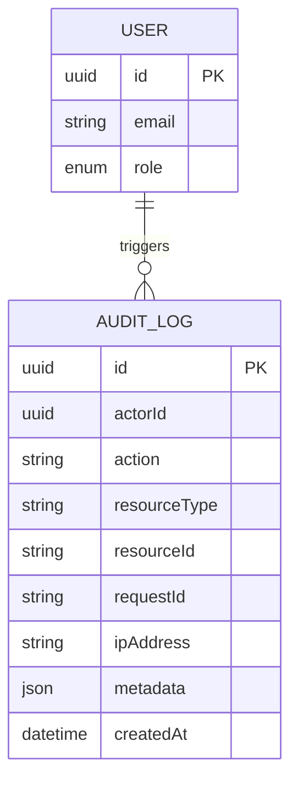
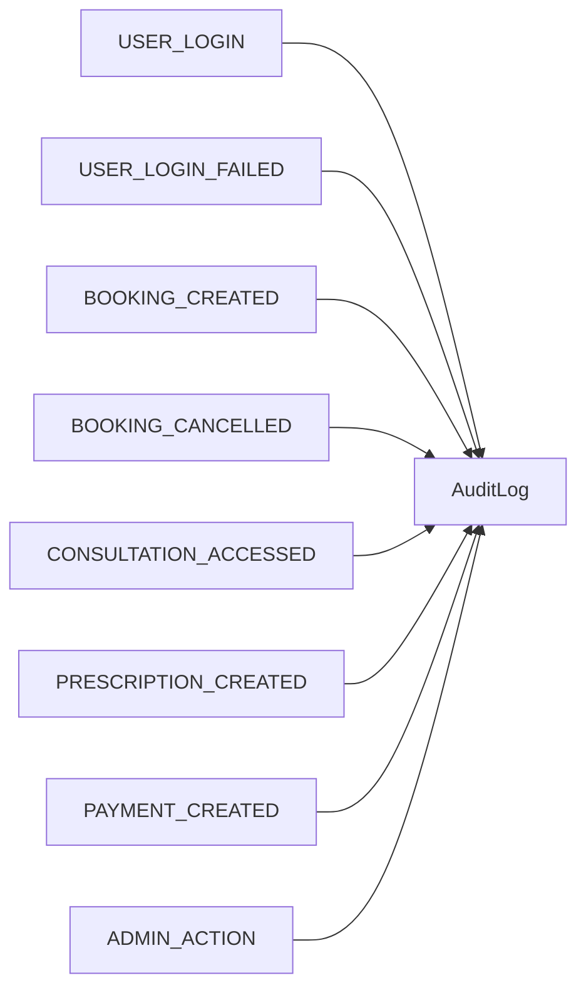
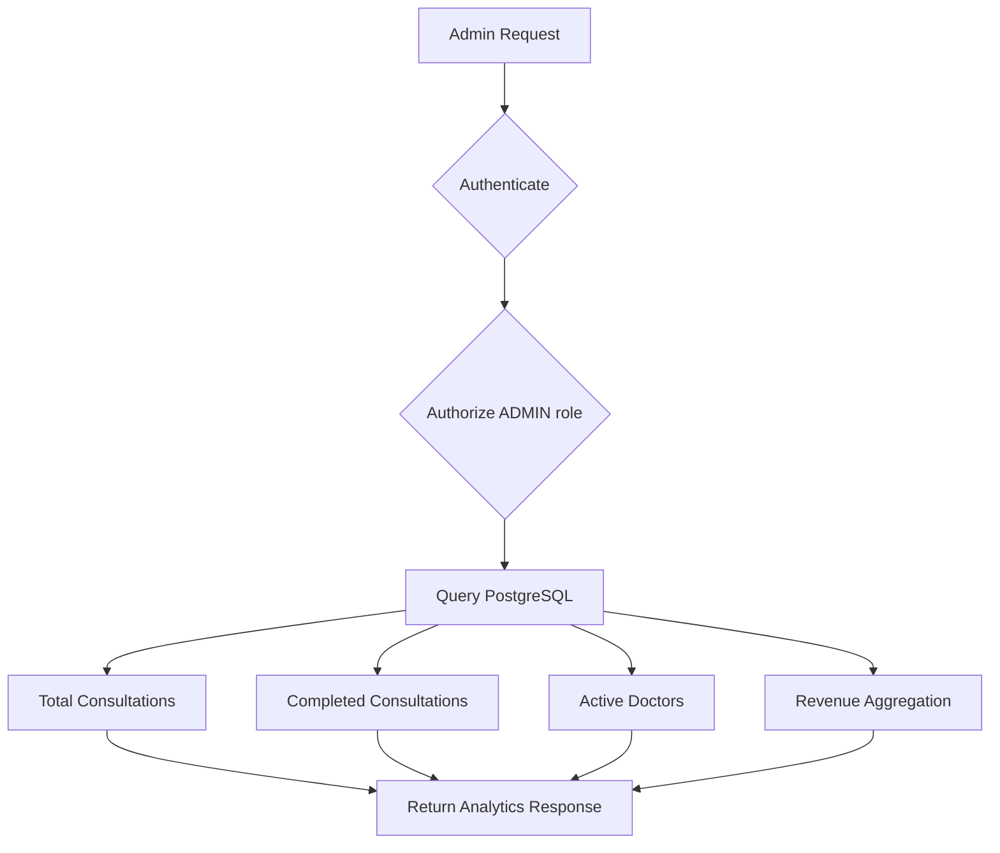
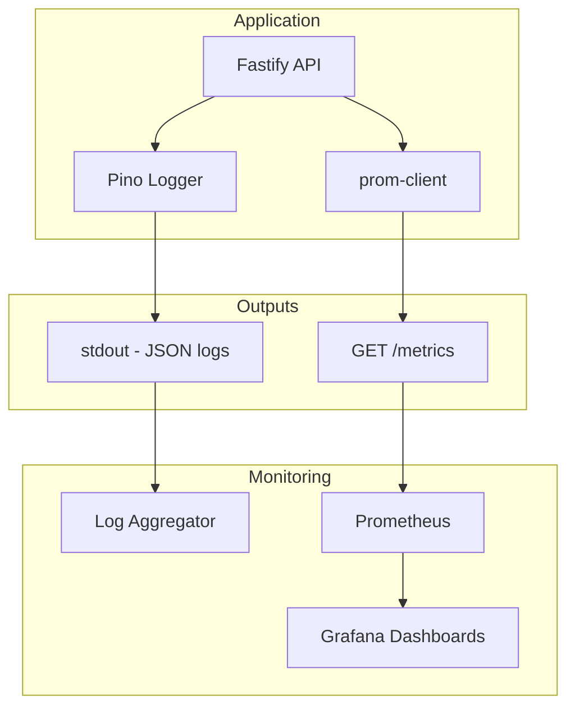

# 1. Audit System

Audit logging is mandatory.

## Audit ERD



## Audit Events



Sensitive medical content should not be dumped into application logs.

---

# 2. Admin Analytics

Endpoint:

```http
GET /api/v1/admin/analytics/overview
```

## Admin Dashboard Data Flow



Expensive analytics should be precomputed, cached, or processed asynchronously rather than repeatedly scanning large transactional tables.

---

# 3. Observability

## Observability Architecture



### Logs

Structured JSON via Pino:

```json
{
  "level": "info",
  "event": "booking.created",
  "requestId": "uuid-correlation-id",
  "userId": "...",
  "bookingId": "..."
}
```

No passwords, tokens, prescriptions or unnecessary medical data.

### Metrics

```text
http_requests_total
http_request_duration_seconds
booking_success_total
booking_failure_total
auth_failure_total
rate_limit_total
```

### Request Correlation

Every request is stamped with a unique UUID correlation ID, enabling trace reconstruction across structured log entries.

---