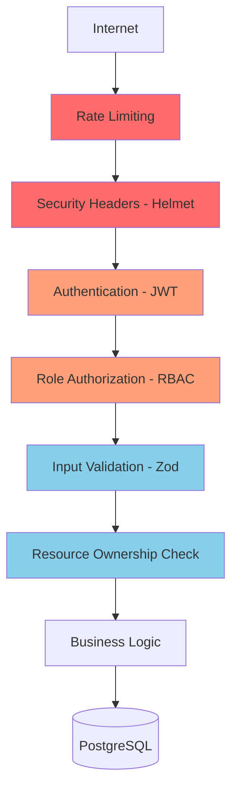
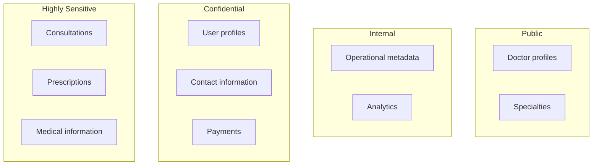
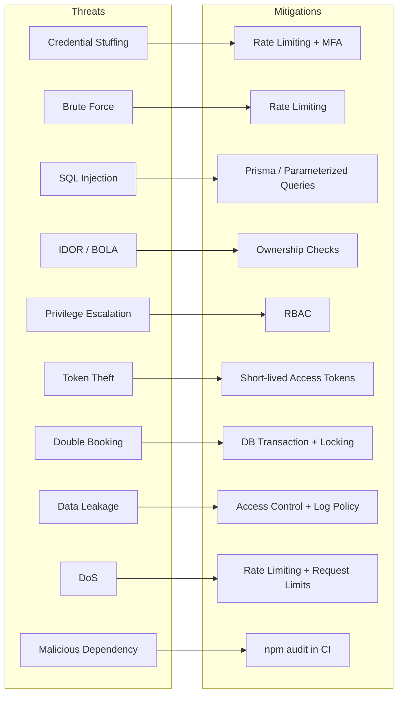
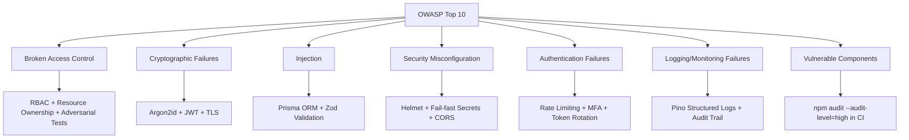

# 1. Security Architecture

## Defense-in-Depth Layers

Security requirements include:

* OWASP mitigation
* Attack surface analysis
* Data classification
* Encryption
* Key rotation
* Audit logs
* Dependency scanning

---

# 2. Data Classification

Highly sensitive information receives stricter access controls and should never be casually exposed through logs.

---

# 3. Encryption

### In transit

HTTPS/TLS.

### At rest

Database/storage encryption provided by the deployment environment.

### Application-level encryption

Only where necessary for particularly sensitive fields.

Encryption keys must:

* Never be committed
* Come from environment/secret management
* Support rotation

---

# 4. Threat Model

| Threat                 | Mitigation                      | Tested |
| ---------------------- | ------------------------------- | ------ |
| Credential stuffing    | Rate limiting + MFA             | ✅     |
| Brute-force login      | Rate limiting                   | ✅     |
| SQL injection          | Prisma/parameterized queries    | ✅     |
| IDOR                   | Ownership checks                | ✅     |
| Privilege escalation   | RBAC                            | ✅     |
| Token theft            | Short-lived access tokens       | ✅     |
| Duplicate booking      | Idempotency                     | ✅     |
| Double booking         | DB transaction + locking        | ✅     |
| Sensitive data leakage | Access control + logging policy | ✅     |
| DoS                    | Rate limiting + request limits  | ✅     |
| Malicious dependency   | npm audit in CI                 | ✅     |
| Secret leakage         | Environment/secret management   | ✅     |

---

# 5. OWASP Security Controls

Authorization controls were adversarially tested against IDOR, privilege escalation, cross-resource access, and mass-assignment scenarios via dedicated test suites (`security.test.ts`).

---