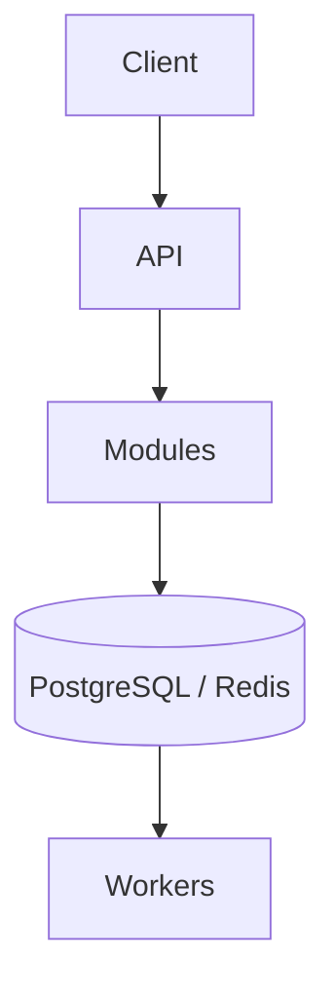
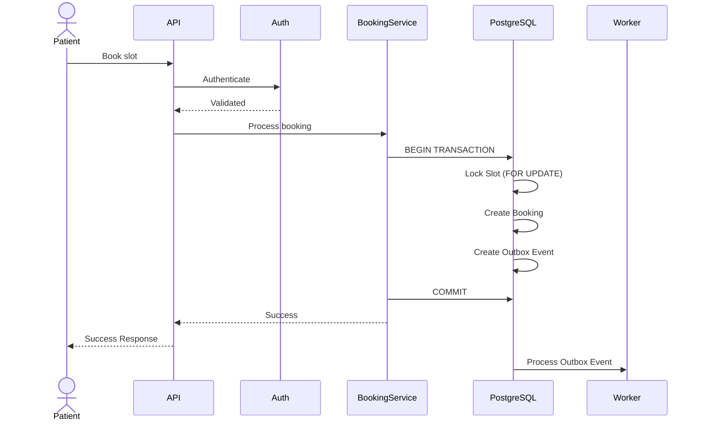
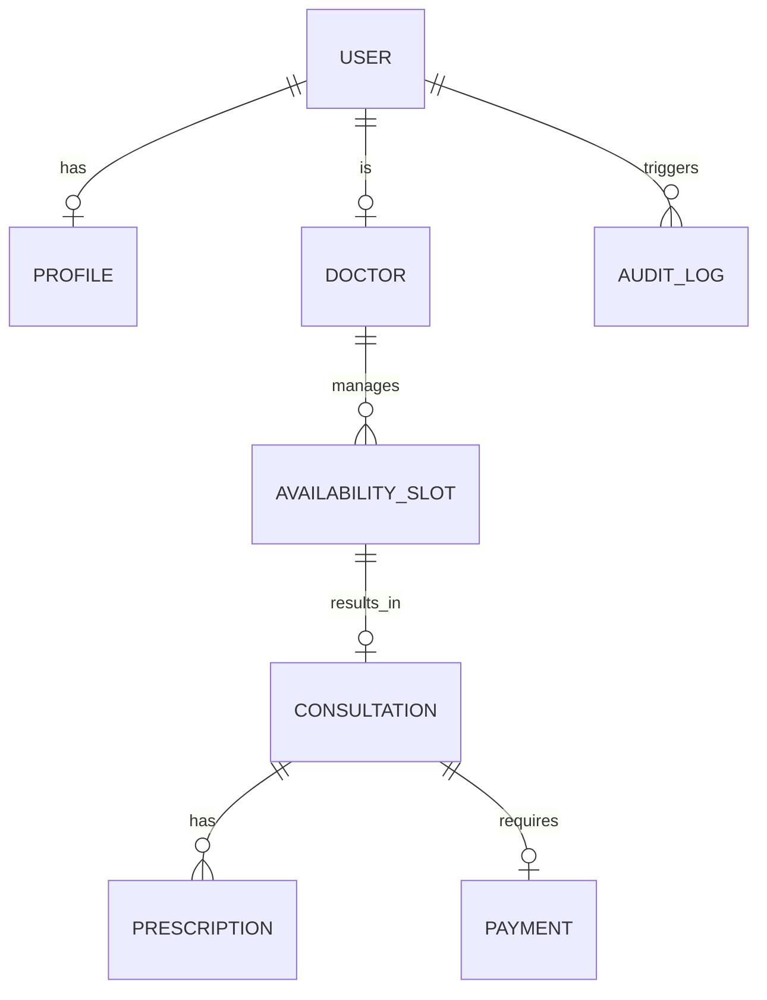

# 1. Redis Strategy

Redis will be used, but carefully.

### Use Redis for:

```text
Rate limiting
MFA temporary state
Doctor/search caching
Short-lived cache entries
```

### Don't use Redis as:

```text
Booking source of truth
Payment source of truth
Consultation source of truth
```

PostgreSQL remains authoritative.

---

# 2. Rate Limiting

Examples:

### Authentication

```text
5 failed attempts / minute
```

### General API

```text
100 requests / minute / user
```

### Admin

More restrictive limits where appropriate.

Exact thresholds are implementation decisions and should be configurable.

Redis provides a shared counter across horizontally scaled API instances.

---

# 3. Background Jobs

We'll use PostgreSQL Outbox.

Example:

```text
BEGIN

Create booking
Create outbox event

COMMIT
```

Then:

```text
outbox_events
      ↓
worker
      ↓
notification
```

Events could include:

```text
BOOKING_CREATED
BOOKING_CANCELLED
CONSULTATION_COMPLETED
PRESCRIPTION_CREATED
PAYMENT_COMPLETED
```

---

# 4. Retry Strategy

For transient failures:

```text
Attempt 1
   ↓
100ms
   ↓
Attempt 2
   ↓
200ms
   ↓
Attempt 3
   ↓
400ms
```

With:

* Exponential backoff
* Jitter
* Maximum retries
* Failure tracking

Only operations that are safe to retry should be automatically retried.

---

# 5. Performance

The targets are:

```text
Reads:  p95 < 200ms
Writes: p95 < 500ms
```

We'll optimize using:

* Database indexes
* Connection pooling
* Pagination
* Efficient queries
* Avoiding N+1 queries
* Redis caching where beneficial
* Async processing
* Horizontal API scaling

---

# 6. Database Design

Core tables required by the assignment:

```text
users
profiles
doctors
availability_slots
consultations
prescriptions
payments
audit_logs
```

Additional supporting tables:

```text
roles
refresh_tokens
idempotency_keys
prescription_items
outbox_events
```

Implementation decisions.

---

# 7. Database Constraints

We should rely on the database to protect invariants.

Examples:

```text
users.email UNIQUE
availability_slots(...)
idempotency_keys(key, user_id) UNIQUE
foreign keys
NOT NULL constraints
CHECK constraints
```

The application should never be the only line of defense.

---

# 8. Transaction Boundaries

### Booking

One transaction:

```text
Lock slot
+
validate slot
+
create consultation
+
update slot
+
create outbox event
+
save idempotency result
```

### Registration

One transaction:

```text
Create user
+
Create profile
```

### Prescription

One transaction:

```text
Validate consultation
+
Create prescription
+
Create prescription items
```

---

# 9. Availability & Consistency

PostgreSQL is the source of truth.

Redis may cache availability reads, but:

```text
Booking → PostgreSQL
```

not:

```text
Booking → Redis
```

This prevents stale-cache booking bugs.

---

# 10. Disaster Recovery

The architecture document must cover backup and DR. 

We'll document:

### Backup

* Automated PostgreSQL backups
* Retention policy
* Backup verification

### Recovery

* Restore procedure
* Point-in-time recovery
* Recovery testing

### RPO

Maximum acceptable data loss.

### RTO

Maximum acceptable recovery time.

For the assignment, these values can be proposed as architectural targets rather than actually building a multi-region disaster recovery environment.

---

# 11. Docker

The assignment requires **containerized deployment**. 

We'll provide:

```text
Dockerfile
docker-compose.yml
```

Development environment:

```text
API
PostgreSQL
Redis
Prometheus
Grafana
```

Production container should run as a non-root user where practical.

---

# 12. CI/CD

Pipeline:

```text
Git Push / PR
      ↓
Install dependencies
      ↓
Lint
      ↓
Typecheck
      ↓
Unit tests
      ↓
Integration tests
      ↓
Security scan
      ↓
Build
      ↓
Docker build
```

The assignment explicitly requires automated tests and a CI pipeline. 

---

# 13. Testing Strategy

## Unit tests

Test:

* Authentication
* Authorization
* Booking business rules
* Consultation state transitions
* Idempotency
* Validation

## Integration tests

Test:

```text
API
+
PostgreSQL
+
Redis
```

## E2E

Full lifecycle:

```text
Register
 ↓
Login
 ↓
Search doctor
 ↓
View availability
 ↓
Book
 ↓
Consultation
 ↓
Prescription
```

## Concurrency

The most important test:

```text
100 simultaneous requests
             ↓
       same slot
             ↓
       ONE succeeds
```

## Security tests

```text
No auth → 401
Wrong role → 403
Wrong resource owner → 403
Invalid input → 400
Rate exceeded → 429
Expired token → 401
```

---

# 14. API Versioning

Use:

```text
/api/v1/...
```

rather than exposing unversioned APIs.

This allows future compatibility.

---

# 15. API Error Contract

Every API should return predictable errors:

```json
{
  "error": {
    "code": "SLOT_ALREADY_BOOKED",
    "message": "The selected slot is no longer available",
    "requestId": "..."
  }
}
```

Don't expose:

```text
stack traces
database errors
internal implementation details
```

in production responses.

---

# 16. Health Checks

Provide:

```text
GET /health
GET /ready
```

### `/health`

Process is alive.

### `/ready`

Dependencies required to serve traffic are healthy.

Potential checks:

```text
PostgreSQL
Redis
```

---

# 17. Graceful Shutdown

When the container receives termination:

```text
Stop accepting requests
       ↓
Finish active requests
       ↓
Close worker processing
       ↓
Close DB connections
       ↓
Close Redis
       ↓
Exit
```

This helps containerized deployments avoid dropped work.

---

# 18. Configuration

All environment-specific values come from environment variables.

Example:

```text
DATABASE_URL
REDIS_URL
JWT_SECRET
JWT_EXPIRES_IN
REFRESH_TOKEN_SECRET
ENCRYPTION_KEY
OTEL_ENDPOINT
```

Provide:

```text
.env.example
```

Never commit actual secrets.

---

# 19. Documentation

Final repository should contain:

```text
README.md

docs/
├── architecture.md
├── booking-flow.md
├── database.md
├── security.md
├── threat-model.md
└── disaster-recovery.md
```

The assignment specifically requires an architecture document of **2–4 pages**, OpenAPI/GraphQL schema, security/threat model, tests/CI, and observability. 

---

# 20. Architecture Diagrams

Required diagrams:

### High-level architecture



### Booking sequence



### ER diagram

Show:



plus payments and audit logs.