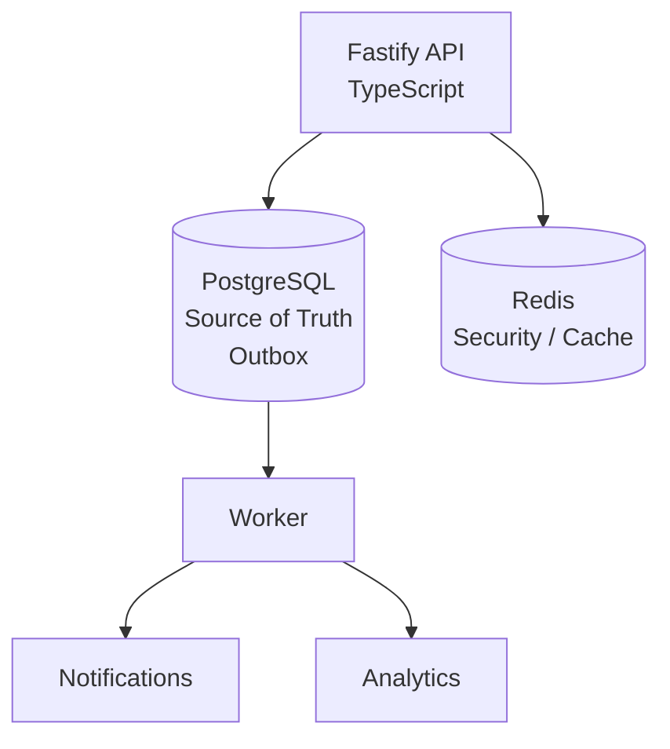

# 1. Definition of Done

The backend is considered complete when:

### Core workflows

* [ ] User registration
* [ ] Login
* [ ] MFA
* [ ] RBAC
* [ ] Doctor management
* [ ] Availability
* [ ] Doctor search/filtering
* [ ] Booking
* [ ] Idempotency
* [ ] Concurrency protection
* [ ] Consultation lifecycle
* [ ] Prescriptions
* [ ] Payments
* [ ] Audit logs
* [ ] Admin analytics

### Security

* [ ] Secure password hashing
* [ ] JWT security
* [ ] Refresh-token handling
* [ ] MFA
* [ ] RBAC
* [ ] Ownership checks
* [ ] Rate limiting using Redis
* [ ] Input validation
* [ ] Security headers
* [ ] Secrets management
* [ ] Encryption strategy
* [ ] Threat model
* [ ] Dependency scanning

### Reliability

* [ ] PostgreSQL transactions
* [ ] Row locking
* [ ] Database constraints
* [ ] Idempotency
* [ ] Outbox
* [ ] Async workers
* [ ] Retry/backoff
* [ ] Backup strategy
* [ ] DR strategy

### Observability

* [ ] Structured logging (Pino)
* [ ] Fastify metrics
* [ ] Traces
* [ ] Request IDs
* [ ] Trace IDs
* [ ] Grafana dashboard

### Infrastructure

* [ ] Docker
* [ ] Docker Compose
* [ ] CI pipeline
* [ ] Migrations
* [ ] Health checks
* [ ] Graceful shutdown

### Documentation

* [ ] README
* [ ] OpenAPI
* [ ] Architecture document
* [ ] Booking sequence diagram
* [ ] ER diagram
* [ ] Security checklist
* [ ] Threat model
* [ ] DR strategy

---

# 2. 4–5 Day Execution Plan

The assignment gives us **4–5 days**, so scope control matters. 

### Day 1 — Foundation

```text
Project setup
TypeScript
Fastify
Prisma
PostgreSQL
Docker
Database schema
Architecture
Authentication foundation
```

### Day 2 — Core Domain

```text
Users
Doctors
Availability
Search
RBAC
MFA
```

### Day 3 — Hard Engineering

```text
Booking
Transactions
Row locking
Idempotency
Concurrency tests
Redis rate limiting
```

### Day 4 — Remaining Workflows

```text
Consultations
Prescriptions
Payments
Audit logs
Outbox
Workers
Admin analytics
```

### Day 5 — Production Hardening

```text
Tests
Security
OpenTelemetry
Prometheus
Grafana
CI
Docker
Threat model
Architecture docs
README
Demo
```

---

# 3. What We Should NOT Overengineer

This is important.

We should **not** add:

```text
❌ Kafka
❌ Kubernetes
❌ Microservices
❌ Elasticsearch
❌ GraphQL + REST
❌ Complex event streaming
❌ Multiple databases
❌ Multi-region infrastructure
```

unless a genuine requirement appears.

Our production architecture is:



That's enough to demonstrate serious backend engineering.

---

# 4. The Three Things That Will Make This Submission Stand Out

If I were optimizing specifically for the rubric, I'd make these **exceptionally good**:

### 1. Booking correctness

Show:

```text
Transaction
+
FOR UPDATE
+
Unique constraints
+
Idempotency
+
100 concurrent request test
```

### 2. Security

Show:

```text
Authentication
+
MFA
+
RBAC
+
Ownership
+
Rate limiting
+
Threat model
+
Audit logs
```

### 3. Production observability

Show:

```text
Request
 ↓
Trace
 ↓
Structured logs
 ↓
Metrics
 ↓
Grafana
```

Because the evaluation explicitly allocates **20 points to architecture, 20 to core flows, 15 to code quality, 10 each to security, observability, scalability and infrastructure/CI**, and gives a **+10 bonus** category. Missing critical security or idempotency can fail the submission. 

---

## Final architecture decision

So, **this is the PRD I'd freeze before implementation**:

> **TypeScript + Node.js + Fastify + Prisma + PostgreSQL + Redis + PostgreSQL Outbox Worker + REST/OpenAPI + Docker + GitHub Actions + Prometheus + Grafana.**

And the architectural philosophy is:

> **PostgreSQL guarantees correctness. Redis accelerates and protects. The application enforces business rules. The worker handles asynchronous work. Observability watches everything. Security exists at every layer.**

That gives us a serious production-grade backend without wasting the 4–5 day window on infrastructure that the assignment never asked for.